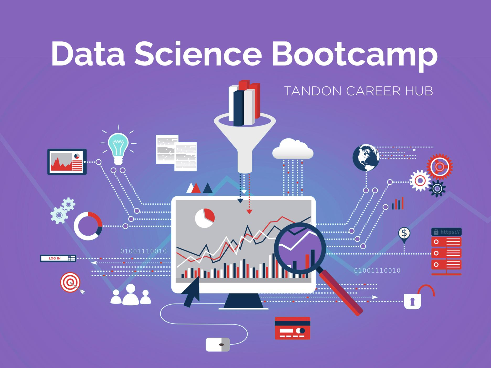

# New York University (NYU) Data Science Boot Camp

**Provided by:** [NYU Tandon School of Engineering Career Hub Data Science Bootcamp](https://engineering.nyu.edu/life-tandon/tandon-career-hub/resources-students/data-science-bootcamp)

---

## 📚 Overview

Welcome to my repository! This repository contains my solutions to the weekly assignments and group projects completed as part of the NYU Data Science Boot Camp. The boot camp focuses on equipping participants with hands-on experience in data science tools, techniques, and frameworks.

---

## 📂 Repository Structure

- **Assignments**: Weekly assignments designed to reinforce concepts learned during the boot camp.
- **Group Projects**: Collaborative projects that showcase teamwork and problem-solving skills in data science.

---

## 🔧 Skills and Tools Covered

During the boot camp, the following skills and tools were utilized:

- **Programming**: Python
- **Data Analysis**: Pandas, NumPy
- **Visualization**: Matplotlib, Seaborn, Tableau
- **Machine Learning**: scikit-learn, TensorFlow, Keras
- **Big Data**: Hadoop, Spark
- **Databases**: SQL, MongoDB
- **Version Control**: Git, GitHub
- **Deployment**: Flask, Streamlit

---

## 🌟 Highlights

- Hands-on projects simulating real-world data science challenges.
- Application of statistical and machine learning techniques to derive insights and predictions.
- Collaboration with peers to develop end-to-end data-driven solutions.

---

## 💼 Projects

### Project Options:
1. **Air Quality Data Visualization**:
   - Analyze air pollution trends in India using temporal, regional, and feature-based insights.
   - Tasks include data cleaning, exploratory data analysis, visualization, and predictive modeling.

2. **Sentiment Analysis of Social Media Content**:
   - Perform sentiment analysis on user-generated content from social platforms.
   - Tasks include temporal, geographical, and platform-specific sentiment trend analysis.

3. **Music Recommendation System**:
   - Develop a recommendation system using Spotify data to suggest songs based on user preferences.
   - Tasks include feature exploration, collaborative filtering, and UI integration.

## 📝 Assignments

- Weekly take-home assignments reinforce key concepts and techniques.
- Solutions must be submitted via the designated submission form by Tuesday at 11:59 PM.

---

## 📜 About NYU Tandon Data Science Boot Camp

The NYU Data Science Boot Camp is an immersive program provided by the NYU Tandon School of Engineering. It aims to transform learners into data professionals ready to tackle modern challenges in industries like finance, healthcare, and technology.

## 🗓️ Weekly Topics

1. **Week 1**: Python Fundamentals
2. **Week 2**: Numpy and Pandas
3. **Week 3**: Exploratory Data Analysis and Data Visualization
4. **Week 4**: SQL Basics
5. **Week 5**: Mid-program Project Presentations
6. **Week 6-8**: Machine Learning Basics and Applications
7. **Week 9**: Final Project Presentations
---

## 📬 Contact

Feel free to reach out if you have any questions or want to discuss data science projects:

- **Name**: Brian J. Lee
- **Email**: brian.lee.great@gmail.com
- **LinkedIn**: https://www.linkedin.com/in/brian-jonghoon-lee-frm-caia-a96438199/
