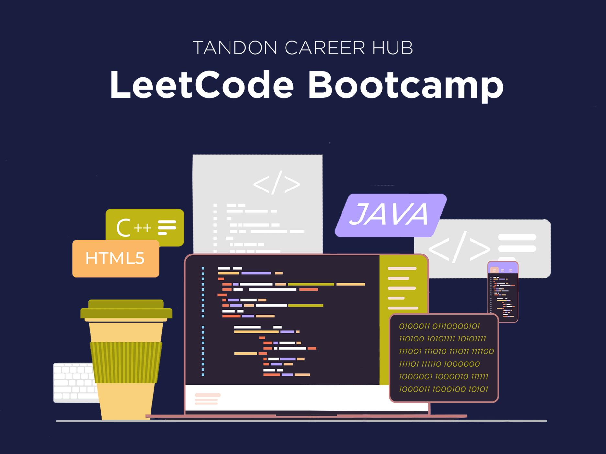

# NYU Tandon LeetCode Bootcamp

**Provided by:** [NYU Tandon School of Engineering Career Hub Leetcode Bootcamp](https://engineering.nyu.edu/life-tandon/tandon-career-hub/resources-students/leetcode-bootcamp)

Welcome to my repository! This repository contains my solutions to the weekly assignments and group projects completed as part of the NYU LeetCode Boot Camp. The boot camp focuses on preparing students for technical interviews by solving LeetCode problems and working on real-world projects.

## 📚 Overview

This bootcamp provided nine weeks of hands-on experience solving LeetCode problems and working collaboratively in a supportive environment. The focus was on mastering fundamental data structures, algorithms, and problem-solving techniques necessary for technical interviews.

---

## 🔧 Skills and Tools Covered

- **Programming**: Python, JavaScript
- **Data Structures**: Arrays, Linked Lists, Graphs, Trees, Heaps, Stacks, Queues
- **Algorithms**: Sorting, Searching, Dynamic Programming, Greedy Algorithms
- **Problem-Solving Platforms**: LeetCode, CodeSignal, NeetCode
- **Web Development** (for projects):
  - **Frontend**: JavaScript, HTML, CSS
  - **Backend**: Python with Flask, React
  - **Database**: SQLite
  - **Authentication**: Firebase
- **Deployment**: Netlify, Vercel

---
## 📂 Repository Structure

- **Assignments**: Weekly take-home problems for LeetCode practice.
- **Projects**: Source code, documentation, and presentation files for group projects.

---
## 🗓️ Weekly Topics

| Week  | Topics                                |
|-------|---------------------------------------|
| 1     | Lists, Arrays, Sorting               |
| 2     | Strings, Hash Maps                   |
| 3     | Matrix, Linked Lists                 |
| 4     | Graphs, Stacks, Queues               |
| 5     | Mid-Program Project Presentations    |
| 6     | Tree, Trie, Heap                     |
| 7     | Search Algorithms (DFS, BFS, BST)    |
| 8     | Greedy Algorithms, Dynamic Programming |
| 9     | Final Project Presentations          |

---
## 🛠️ Projects

Students collaborated in groups of 4-5 to work on real-world projects. Project examples include:

1. **Scholarly Insight**: A web application to search and browse scholarly articles using the arXiv API.
2. **DineWise**: A restaurant comparison and review platform using the Yelp API.
3. **Movie Magic**: A movie and TV show discovery platform using the TMDb API.
4. **Congress Tracker**: A web application to track U.S. legislative data using the Congress API.
5. **Crypto Tracker**: A cryptocurrency tracking and portfolio management tool using the CoinGecko API.

### Project Timeline
- **Week 1**: Team formation, API exploration
- **Weeks 2-4**: Backend development
- **Week 5**: Mid-program presentation
- **Weeks 6-7**: Frontend development, feature finalization
- **Week 8**: Deployment, final testing
- **Week 9**: Final presentation

### Judging Criteria
Projects were evaluated based on:
- **Design**: Structured and systematic problem-solving approach.
- **Execution**: Effectiveness in addressing the problem statement.
- **Presentation**: Clarity and depth of the final presentation.

---

## 📬 Contact

For any questions or discussions, feel free to reach out:

- **GitHub User**: [BrianLee11](https://github.com/BrianLee11)
- **Name**: Brian J. Lee
- **Email**: [brian.lee.great@gmail.com](mailto:brian.lee.great@gmail.com)
- **LinkedIn**: [Brian J. Lee on LinkedIn](https://www.linkedin.com/in/brian-jonghoon-lee-frm-caia-a96438199/)

---

**Happy Coding! 🚀**
